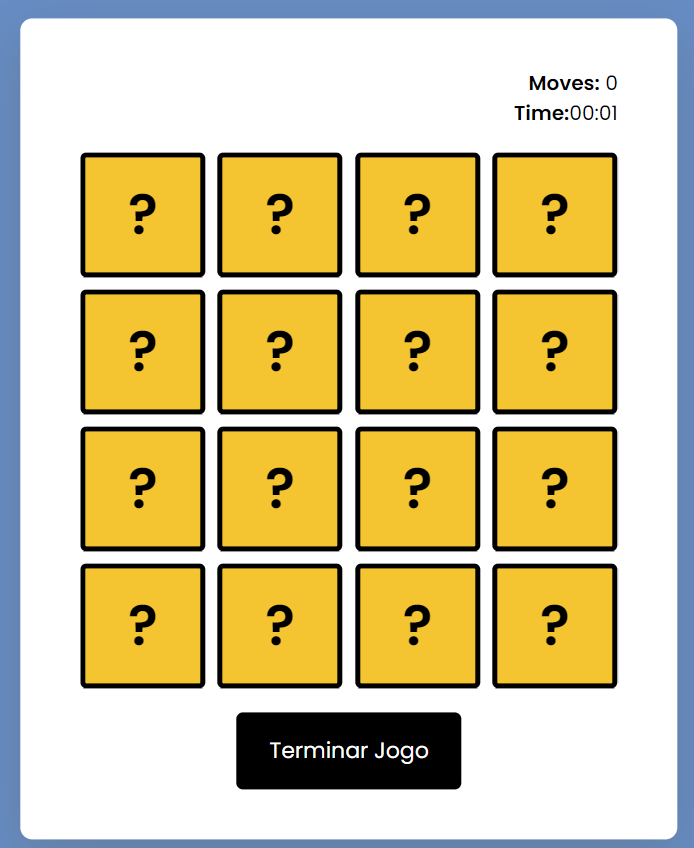
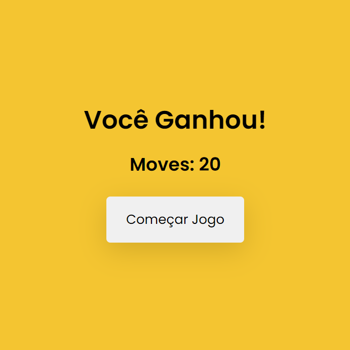

# Jogo da Memória - Projeto JavaScript

Este é um simples jogo da memória desenvolvido em JavaScript e HTML. O jogo apresenta cartas com imagens de animais, e o jogador deve encontrar todos os pares correspondentes.

  

### Seleção dos Card

  

### Você ganhou o Jogo!

  

## Funcionalidades

- **Controle de Tempo e Movimentos:** O jogo conta o tempo decorrido e os movimentos feitos pelo jogador.

- **Geração Aleatória:** As cartas são dispostas aleatoriamente no tabuleiro a cada reinício do jogo.

- **Feedback Visual:** As cartas viram ao serem clicadas, e pares correspondentes permanecem visíveis. Em caso de pares incorretos, as cartas são viradas novamente após um breve intervalo.

- **Encerramento e Resultados:** O jogo pode ser encerrado a qualquer momento, exibindo o resultado final, incluindo o número de movimentos realizados.

## Como Jogar

1. Clique no botão "Começar Jogo" para iniciar.
2. Clique nas cartas para revelar suas imagens.
3. Encontre todos os pares correspondentes.
4. Clique em "Terminar Jogo" a qualquer momento para encerrar.

## Como Rodar o Jogo

Basta abrir o arquivo `index.html` em seu navegador preferido.

---

**Divirta-se jogando!**
