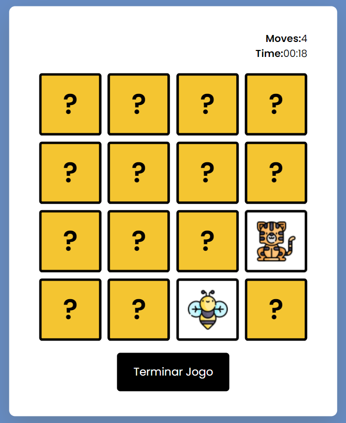

# Jogo da Memória

## Interface do Projeto

  

## Sumário

- [Tecnologias Utilizadas](#tecnologias-utilizadas)
- [Status](#status)
- [Descrição](#descrição)
- [Funcionalidades](#funcionalidades)
- [Como Jogar](#como-jogar)
- [Como Rodar o Jogo](#como-rodar-o-jogo)
- [Divirta-se jogando!](#divirta-se-jogando)

## Tecnologias Utilizadas

  

    
  

  

    
  

  

    
  

## Status

## Descrição

Este é um simples jogo da memória desenvolvido em JavaScript e HTML. O jogo apresenta cartas com imagens de animais, e o jogador deve encontrar todos os pares correspondentes.

## Funcionalidades

- **Controle de Tempo e Movimentos:** O jogo conta o tempo decorrido e os movimentos feitos pelo jogador.

- **Geração Aleatória:** As cartas são dispostas aleatoriamente no tabuleiro a cada reinício do jogo.

- **Feedback Visual:** As cartas viram ao serem clicadas, e pares correspondentes permanecem visíveis. Em caso de pares incorretos, as cartas são viradas novamente após um breve intervalo.

- **Encerramento e Resultados:** O jogo pode ser encerrado a qualquer momento, exibindo o resultado final, incluindo o número de movimentos realizados.

### Seleção dos Card

  

### Você ganhou o Jogo!

  

## Como Jogar

1. Clique no botão "Começar Jogo" para iniciar.
2. Clique nas cartas para revelar suas imagens.
3. Encontre todos os pares correspondentes.
4. Clique em "Terminar Jogo" a qualquer momento para encerrar.

## Como Rodar o Jogo

Basta abrir o arquivo `index.html` em seu navegador preferido.

## Estrutura do Projeto

- `index.html`
- `script.js`
- `style.css`

## Autor

Desenvolvido por Diego Franco.
